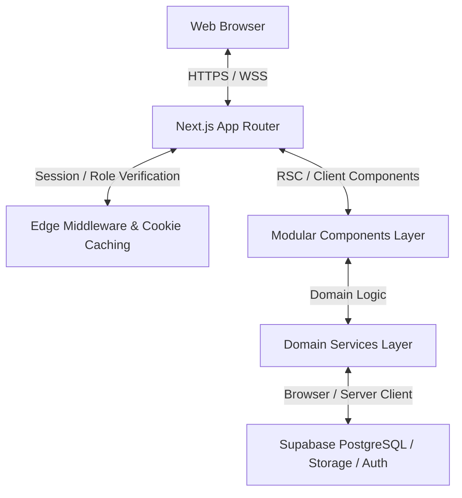
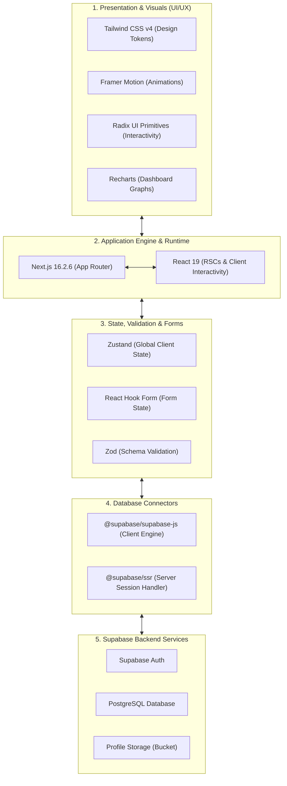
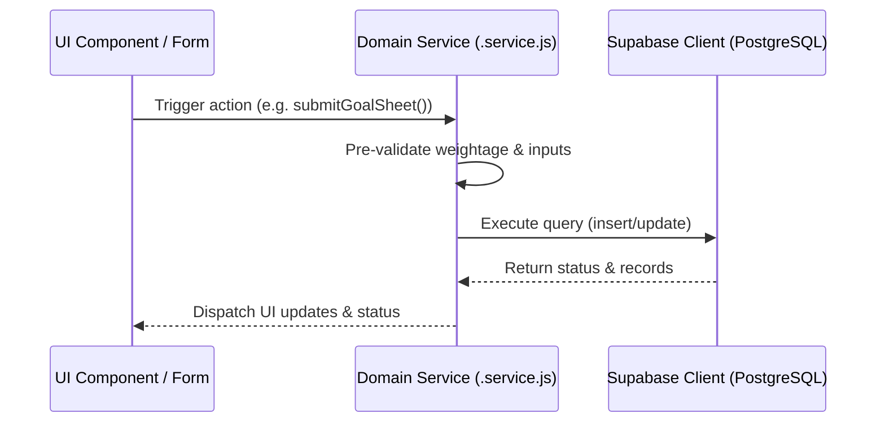

# 🏛️ Nucleus Portal - System Architecture

This document provides a comprehensive overview of the system architecture, file organization, routing strategies, data flow, and design patterns utilized in the **Nucleus Performance Goal Setting & Tracking Portal**.

---

## 🗺️ High-Level Component Architecture

The application is built using a modern **Next.js (App Router)** frontend, integrated with **Supabase (PostgreSQL + Auth)** for data persistence, role management, and session handling.



---

## 🛠️ Tech Stack & Technologies

The portal is engineered utilizing modern, high-performance, and enterprise-grade tools:



### Stack Breakdown:

### 1. Frontend Framework & Runtime
* **Next.js 16.2.6 (App Router)**: Orchestrates server-side rendering (SSR), React Server Components (RSCs), Suspense boundaries, edge middleware checking, and modular router groups.
* **React 19.2.4 & React DOM 19.2.4**: Features concurrent UI rendering, optimized client hooks, and standard Suspense loading integrations.

### 2. Backend, Database & Session Layer
* **Supabase (`@supabase/supabase-js` v2.105.4)**: Real-time PostgreSQL client for modular query interactions, file storage buckets, and database state updates.
* **Supabase SSR (`@supabase/ssr` v0.10.3)**: Configures server-side session refreshes, cookie handshakes, and role verifications in Next.js Server Components and Middlewares.

### 3. Styling, Accessibility & Design Tokens
* **Tailwind CSS v4**: CSS token engine utilizing modern HSL/OKLCH themes, semantic variables, grid dots overlays, and custom view-transition styles.
* **Radix UI Primitives**: Accessible primitives (Select, Dialog, Tabs, DropdownMenu) offering full keyboard traversal and screen reader support.

### 4. Logic, Schema Validation & State
* **React Hook Form (v7.75.0)**: Coordinates client form entries with lightweight, zero-re-render state management.
* **Zod (v4.4.3)**: Static schema-level verification verifying goals, metrics configurations, and weights validity rules.
* **Zustand (v5.0.13)**: State store driving UI alerts, drawer states, and global component behaviors.

### 5. Data Visualization & Micro-Animations
* **Recharts (v3.8.1)**: Renders SVG performance progression data charts on user dashboards.
* **Framer Motion (v12.38.0)**: Renders layout animations, spring transition curves, and premium UI micro-interactions.
* **Sonner (v2.0.7)**: Displays elegant toast notifications.

---

## 📂 Directory & Modular File Structure

The project strictly follows a decoupled, domain-driven folder layout:

```text
src/
├── app/                        # Next.js App Router (Routable Views)
│   ├── (public)/               # Public-facing routes (No auth needed)
│   │   ├── page.js             # Hero/Landing page
│   │   └── (auth)/             # Auth routes (Wrapped in restricted AuthLayout)
│   │       ├── login/          # User Sign in
│   │       ├── signup/         # User Registration
│   │       ├── forgot-password/# Password Recovery trigger
│   │       └── reset-password/ # Password Reset landing
│   ├── (protected)/app/        # Protected routes (Requires active session)
│   │   ├── layout.js           # Protected dashboard grid layout (DashboardShell)
│   │   ├── dashboard/          # Performance metrics & activity logs
│   │   ├── goals/              # Employee goal list & manager notes
│   │   │   └── edit/           # Draft & submission editor
│   │   ├── approvals/          # Manager-side review board
│   │   ├── checkins/           # Weekly/quarterly goal check-ins
│   │   ├── team-goals/         # Cross-team goal sheets
│   │   ├── cycles/             # HR cycle configuration board
│   │   └── profile/            # User settings & avatars
│   ├── globals.css             # Tailwind token configuration & view transitions
│   └── layout.js               # Root layout (Base HTML wrapper)
│
├── components/                 # Reusable Presentation & Logical UI Components
│   ├── badges/                 # Semantic status indicators (e.g., StatusBadge)
│   ├── dialogs/                # Modals, drawers, and confirmations
│   ├── empty-states/           # Uniform error and empty boundaries
│   ├── forms/                  # Complex form handlers (e.g., GoalSheetForm with weightage verification)
│   ├── layout/                 # Application frame UI (Sidebar, TopNav, ThemeToggle)
│   ├── loaders/                # Shimmer skeleton shells (LoadingSkeleton, GoalSheetSkeleton)
│   └── tables/                 # Searchable & paginated tables (DataTable)
│
├── constants/                  # Static values, routes, and navigation definitions
│   └── navigation.js           # Role-based navigation schemas
│
├── lib/                        # Infrastructure, configs, and client clients
│   ├── auth/                   # Role labels, mapping, and permissions
│   └── supabase/               # Client initializations & middleware utils
│
├── providers/                  # Context boundaries (AuthProvider)
│   └── auth-provider.js        # Global authentication context and active profiles
│
└── services/                   # Decoupled domain service functions (Supabase clients)
    ├── activity.service.js     # Activity/Audit log operations
    ├── auth.service.js         # Authentication helpers
    ├── checkin.service.js      # Goal check-in updates
    ├── crud.service.js         # Base generic Supabase helper class
    ├── cycles.service.js       # Review cycle managers
    ├── goal.service.js         # Individual goal CRUD operations
    ├── notification.service.js # System alerts & email push hooks
    ├── profile.service.js      # Avatar storage and personal details
    └── user.service.js         # HR user list management
```

---

## 🔐 Authentication, Session & Role Cache

### 1. Edge Middleware (`src/middleware.js`)
* Executes on **Vercel Edge/Server Runtime** before resolving page assets.
* Refreshes the active user session directly with the database on incoming requests.

### 2. Cookie-based Role Caching (`src/lib/supabase/middleware.js`)
* Performance optimization to eliminate database lookups for user roles on every segment change.
* Reads/writes role configurations into a secure HTTP-Only cookie, allowing fast RSC (React Server Component) layouts to serve role-tailored elements without query waterfalls.

---

## 📊 Core Data Flow & Services

All queries are abstracted out of UI components and reside cleanly in the `src/services/` layer, inheriting boilerplate CRUD functions from `crud.service.js`.



---

## ⚡ Performance Optimizations

1. **RSC Suspense Boundaries**: Layout pages under `src/app/(protected)/app/` are paired with modular, high-fidelity Loading Skeletons. Suspense wrappers ensure pages load instantly, showing high-contrast shimmers while background queries resolve.
2. **Generic Database Abstraction**: Common database interfaces (inserts, updates, queries) use a standard `crud.service.js` blueprint, reducing boilerplate code and code duplication.
3. **Decoupled Route Groups**: Public entry points (`page.js` hero landing) and authentication structures (`login/`, `signup/`) are organized into distinct route groups (`(public)` and `(public)/(auth)` respectively) to isolate visual components and prevent style interference.
